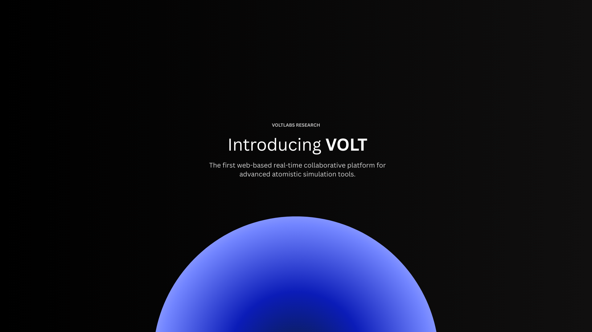

The next-generation platform designed for high-performance research teams and enthusiastic materials scientists!

## Why Volt?

Because it saves you time by bringing your entire daily workflow into one place-together with your team. Volt provides an enterprise-grade platform with instant messaging, real-time collaboration for simulation visualization, and scalable algorithm execution. No matter the size of your workloads, Volt simply scales with you.

Visualize simulations with up to 100 million atoms directly from your browser. Analyze them using servers you already have access to instead of relying on your local hardware. Everything runs in the cloud-fast, accessible, and ready whenever you need it.

Prefer writing code? Volt supports Jupyter notebooks, allowing you to analyze your simulation results programmatically using standard industry tools and libraries.

Or let Volt AI help you. Just ask. Volt AI understands the patterns in your analyses and can explain results, generate charts, and produce complete studies from simple prompts-helping you move faster and focus on what matters.

Running out of storage or compute resources as your team grows? Not a problem. You can add as many clusters as you need. A cluster can be anything-from an old unused computer to high-performance servers.

Inside Volt, you can run as many LAMMPS instances as you want, assigning resources according to your cluster’s capabilities. You can also spin up virtualized Linux environments using Docker containers for fully customizable workflows.

Already have simulations stored on another server? You don’t need to upload them to a cloud provider. Volt allows you to import them directly via SSH, connecting seamlessly to your existing infrastructure.

Need to share results with other teams? You're just one link away. They can access everything directly in the browser-no downloads required. Everything stays in the cloud.

And if you ever want to step outside the Volt ecosystem, you can still access your analyses programmatically using VoltSDK and secret keys through the API.

Managing different roles within your team? Volt includes granular permissions and access control, allowing you to manage who can access resources, run analyses, or modify data.

**Volt itself has no built-in assumptions about atoms beyond them being points in 3D space.** That freedom lets you integrate new algorithms, build your own plugins, and share them with others. Volt is fully modular by design.

## How Volt stays free
Volt can remain free thanks to two flexible ways of using the platform:

### 1. Connecting your own cluster
By connecting a cluster (for example your computer or a server) to app.voltcloud.dev, all heavy computations run on the cluster you configured, not on our infrastructure.

### 2. Self-hosting 
You can also deploy Volt entirely within your own infrastructure. This works similarly to the first option, but gives you full control over the platform.

When using the cloud option, your clusters handle CPU-intensive tasks and large data storage, while metadata and collaboration features-such as trajectory metadata, teams, plugins, analyses, activity logs, and messaging, are stored in Volt Cloud.

Because this cloud is a free service, it may be discontinued without notice if funding for the infrastructure becomes unavailable, which could result in the loss of stored metadata. For full control and permanence, self-hosting is recommended, but it can be a bit tedious if you're not familiar with it.